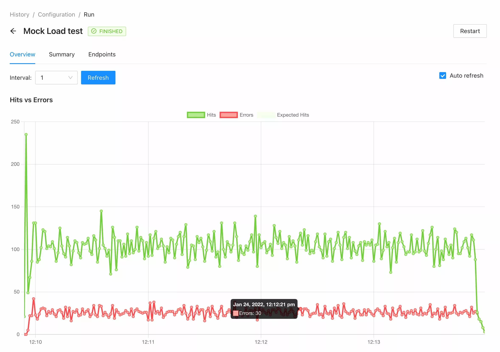

**Maestro** is a load testing tool, building on our years of experience in the load and performance testing industry. It provides a clean, approachable way of running Jmeter based tests.

## Features

####  WEB-based UI

Maestro provides a list of endpoints from where you can analyze your test execution in real-time. There is a full overview of all charts and use cases available in the [Introduction section](./docs/intro.md)



#### Distributed & Scalable

The core concept of having agents deployed inside your infrastructure gives a lot of flexibility to make the tests stable, secure, and able to ***support the simulation of thousands requests/second***. 

#### Collaborative environment

*Real-time monitoring*, *Collaboration over results*, *Programmability* are core things that Maestro focused on to make sure you can collaborate with your teams and improve over time. 

## Getting started

The commands below would help to get the application up and running. It also will give a general feeling of how it works.

**Requirements**:

- docker >=20.10
- docker-compose >=2.2.1

```bash
# All Jmeter artifacts would be stored in the following folder
mkdir -p /tmp/maestrojmeter
docker-compose up
```

## Contributing

Pull requests are welcome. For major changes, please open an issue first to discuss what you would like to change.

Please read the [CONTRIBUTING](CONTRIBUTING.md) file to know what we expect from your contribution and the guidelines you should follow.

## Maintainers

- [Vitalii Melnychuk](https://github.com/vitaliimelnychuk)
- [Nuno Dionísio](https://github.com/nunodio)
- [Dyego Wermelinger](https://github.com/dyegowermelinger)

## License

[MIT](LICENSE)
