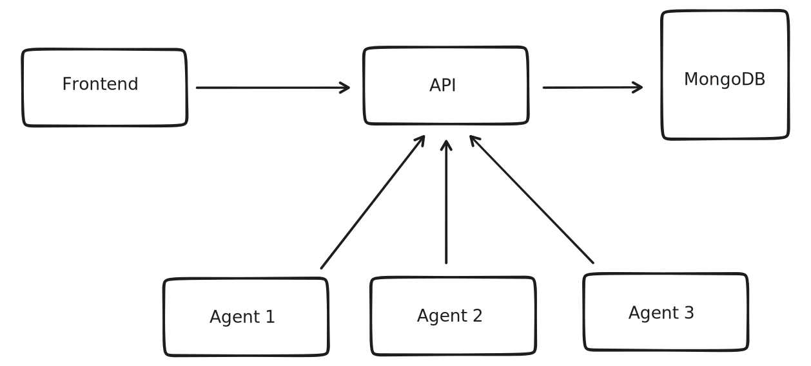

# Architecture

The core idea to use the above mentioned infrastructure is to have the ability to execute distributed performance tests. Agents have important role to provide level of scaling as far you need.

## Services

- **Frontend** is based on React.js and Ant design library. There are also a few others like `chartjs` that is used for visualisation to make great user experience during performance tests execution

- **API** is Python Flask REST application that is used by Frontend and agents. API also can be used by third-party scripts to download the data or trigger the test programmatically ( as an example from CI).

- **Agent** is Python application that should be started in each host machine to run performance tests. Application developed based on Python Docker library and operates Jmeter Docker images to run Jmeter Client/Server based on configuration defined by user.

- **MongoDB** is primary database that is used to store all data from tests configuration to each tests metrics. The data from Mongo is mostly available by using API.
