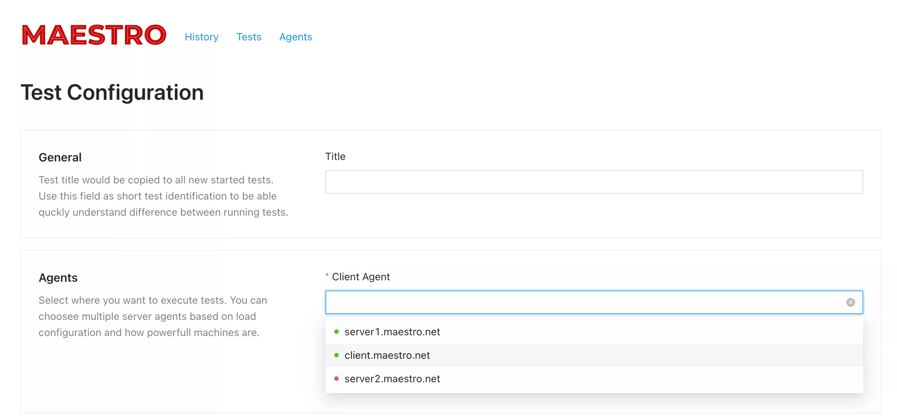
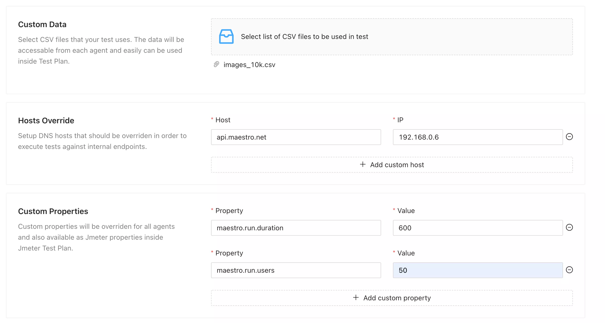

# Create Test

Once you have environment up & running, it's time to run the test.

Before you start exploring Maestro, let's create Jmeter test that needs to be executed. You can download just smoke test to see Maestro from action from [here](../assets/jmx/dummy_sampler.jmx).

Maestro test is reusable configuration from where you can start test. The configuration is connected to all runs that makes possible to run the test quickly and know which configuration was used.

To create a test, you should go to `/tests/new` or `/tests` and click on the `Create` button.

## Agents

Once Agent started, it will be registered and shown on the API side along with status if there any test running on specific agent.

There two types of agents that used by Maestro. Client agent can be only one host and responsible for:

- Sending real-time metrics to the API
- Controlling state of Server agents once something goes wrong.

Speaking about server agents, they are mostly doing test execution by running Jmeter containers.

Both, client and server agents are running the same Jmeter image with all custom data available inside. The only difference in test execution is Jmeter container command.

## Jmeter Test Plan

If you don't have any tests created, just download the one we mentioned above and store it inside configuration.

There also a few other options of how you can control test execution:

### Custom Data

Custom data will be available with the same as you have during upload. For easy access we have `maestro.run.custom_data_dir` that can be used as Jmeter property: `${__P('maestro.run.custom_data_dir')}`. By default maestro uses `/srv/run/custom_data` path inside Jmeter container to store all files there. **We highly recommend to use Jmeter properties to access your custom data from the test.**

### Hosts override

Hosts configuration could be useful for testing internal APIs. If for any reason you need to change the IP address behind specific field, just add them here and they all will be passed to running Jmeter container.

### Custom properties

As in example above, custom properties could be used to configure count of users or test duration. Using them is convenient if you don't need to change test plan behaviour but there are a few things that could have been changed from environment to environment.

## Load Profiler

The configuration relies on the [Jmeter traffic shaping plugin](https://jmeter-plugins.org/wiki/ThroughputShapingTimer/).

Enable this plugin in your test and Maestro will pass `load_profile` property values accordingly.
