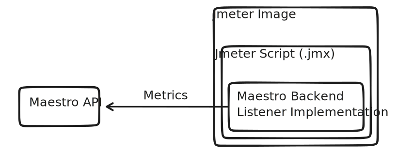

# Metrics

The Backend Listener is responsible for sending metrics to the Maestro API using the HTTP protocol. With the data available, Maestro will present live results through nice graphs for the collected metrics.



This component is added automatically in the script therefore is not necessary any manual modification on the script.

List of metrics:

- All Threads
- Group Threads
- Idle Time
- Data Type
- Connect
- Label
- Thread Name
- URL
- Response Code
- Latency
- Time Stamp
- Elapsed
- Success
- Bytes
- Response Message
- Failure Message
- Sent Bytes

### Downloading the Metrics

When the test finish, Maestro allows you download the metrics samples exporting a CSV file, with the same format as '.jtl' file.

File example:

```csv
timeStamp,elapsed,label,responseCode,responseMessage,threadName,dataType,success,failureMessage,bytes,sentBytes,grpThreads,allThreads,URL,Latency,IdleTime,Connect
1646145491847,324,/api/login,200,OK,Thread Group 1-17,text,true,,114,0,30,30,,10,0,1
1646145493011,3131,/api/homepage,200,OK,Thread Group 1-26,text,true,,114,0,30,30,,30,0,4
1646145493740,728,/api/resetpassword,500,NOK,Thread Group 1-26,text,false,,114,0,30,30,,3,0,20
```

### Getting Metrics using API

The metrics can be also accessed using the API: `/api/run_metrics/{run_id}`.

Use the [Swagger template file](https://github.com/Farfetch/maestro/blob/master/web/api/maestro_api/swagger/template.yml) to see the documentation about how to get the metrics.

### About the Maestro Backend Listener Implementation

The Maestro Backend Listener Implementation was created based on the Jmeter Backend Listener in order to increase performance and resilience.

Read more about the Maestro Backend Listener Implementation [here](https://github.com/Farfetch/maestro/tree/master/jmeter/plugins/jmeter-backendlistener-maestro).
