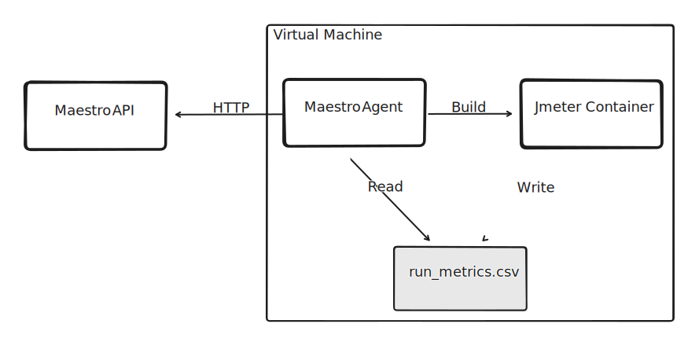

# Metrics

The Jmeter listener [Simple Data Writer](https://jmeter.apache.org/usermanual/component_reference.html#Simple_Data_Writer) is responsible to generate the metrics. These metrics are then read by the Maestro Agent, which is responsible for sending them to the Maestro API using the HTTP protocol. Once the data is available, Maestro will present real-time results through nice graphs for the collected metrics.


:::info
It's mandatory to insert the listener to visualize the live metrics on Maestro GUI charts.
:::

### Configuring the Simple Data Writer

Add the listener [Simple Data Writer](https://jmeter.apache.org/usermanual/component_reference.html#Simple_Data_Writer) in your Jmeter script with the defaults configurations and set the filename parameter as `${__P(maestro.run.metrics_file)}`.

By default Jmeter container (created by the Maestro Agent) mounts a directory and bind it with the Virtual Machine, allowing to access the file on the path `/mnt/maestroagent/{test_id}/run_metrics.csv` inside the virtual machine.

### Downloading the metrics

When the test finish, Maestro allows you download the metrics samples exporting a CSV file, with the same format as `.jtl` file.

File example:

```csv
timeStamp,elapsed,label,responseCode,responseMessage,threadName,dataType,success,failureMessage,bytes,sentBytes,grpThreads,allThreads,URL,Latency,IdleTime,Connect
1688054658393,50,/test/request-ok,200,OK,Thread Group 1-2,text,true,,114,0,20,20,null,5,0,3
1688054659393,50,/test/request-ok,200,OK,Thread Group 1-1,text,true,,114,0,20,20,null,5,0,3
1688054661396,50,/test/request-ok,200,OK,Thread Group 1-6,text,true,,114,0,20,20,null,5,0,3
1688054661396,50,/test/request-ok,200,OK,Thread Group 1-4,text,true,,114,0,20,20,null,5,0,3
```

### Getting metrics using API

The metrics can be also accessed through the API: `/api/run_metrics/{run_id}`.

Use the [Swagger template file](https://github.com/Farfetch/maestro/blob/master/web/api/maestro_api/swagger/template.yml) to see the documentation about how to get the metrics.


### Metrics processor explanation



Before explaining the process, it is important to highlight the three main components involved:

1 - JMeter Container: This component generates the metrics file using the 'Simple Data Writer' listener. It runs the test and produces the file called 'run_metrics.csv'.

2 - Maestro Agent: The Maestro Agent reads the 'run_metrics.csv' file and aggregates the metrics. It then sends the aggregated metrics as HTTP requests in groups of X to the Maestro API.

3 - Maestro API: This component receives the metrics from the Maestro Agent and processes them. It stores the metrics in a database, both in an aggregated form and line by line.

The process starts with the initiation of the tests. The Maestro Agent creates a new JMeter container that is responsible for running the test. The JMeter script is configured with the 'Simple Data Writer', which generates the 'run_metrics.csv' file within the container. The JMeter container is bound to the directory `/mnt/maestroagent/` of the host.

The Maestro Agent includes a job that starts when the tests begin. This job reads the metrics file `run_metrics.csv` and sends the metrics data through HTTP requests to the Maestro API. The API then processes the received metrics, saving them in both aggregated and individual line formats.