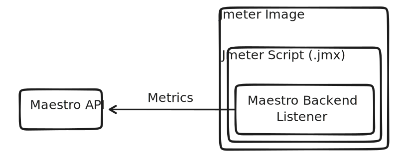

# Metrics

The Backend Listener is responsible for sending metrics to the Maestro API using the HTTP protocol. With the data available, Maestro will present live results through nice graphs for the collected metrics.



This component is added automatically in the script therefore is not necessary any manual modification on the script.

List of metrics:
- All Threads
- Grp Threads
- Idle Time
- Data Type
- Connect
- Label
- Thread Name
- URL
- Response Code
- Latency
- Time Stamp
- Elapsed
- Success
- Bytes
- Response Message
- Failure Message
- Sent Bytes

### Download metrics
When the test finish, Maestro allows you download the metrics samples exporting a CSV file, with the same format as .jtl file.

File header layout: 
```bash
timeStamp,elapsed,label,responseCode,responseMessage,threadName,dataType,success,failureMessage,bytes,sentBytes,grpThreads,allThreads,URL,Latency,IdleTime,Connect
```

### Getting Metrics using API
The metrics can be also accessed using the API: `/api/run_metrics/{run_id}`.

Use the Swagger section to see the documentation about how to get the metrics.


### About the Maestro Backend Listener Implementation
The Maestro Backend Listener Implementation was created based on the Jmeter Backend Listener in order to increase performance and resilience.

Read more about the Maestro Backend Listener Implementation [here](https://github.com/Farfetch/maestro/tree/master/jmeter/plugins/jmeter-backendlistener-maestro).