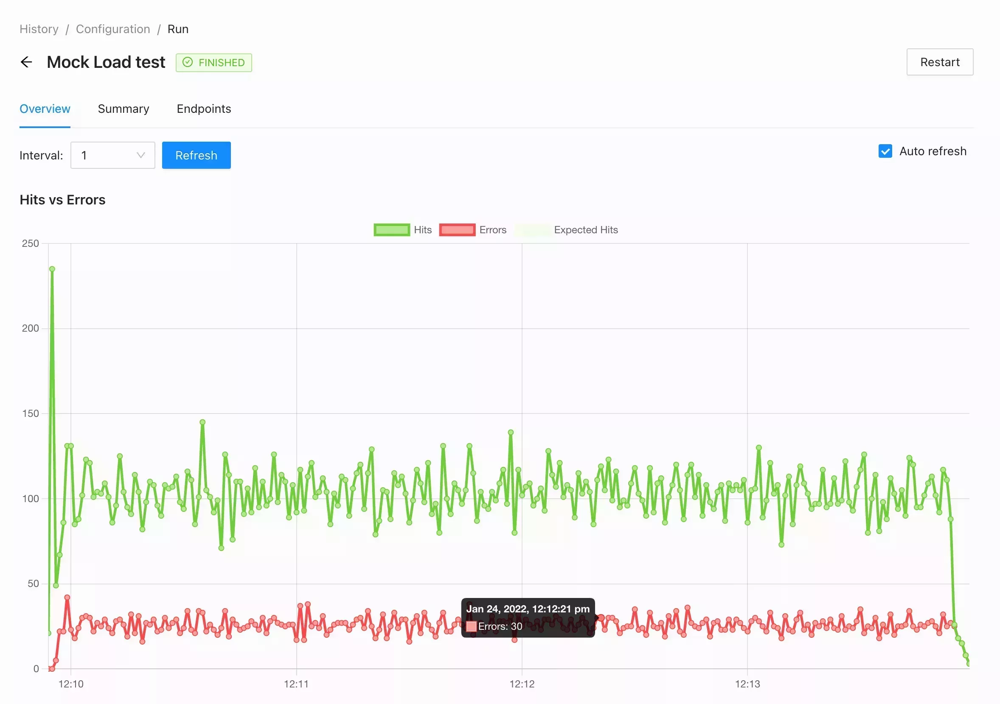
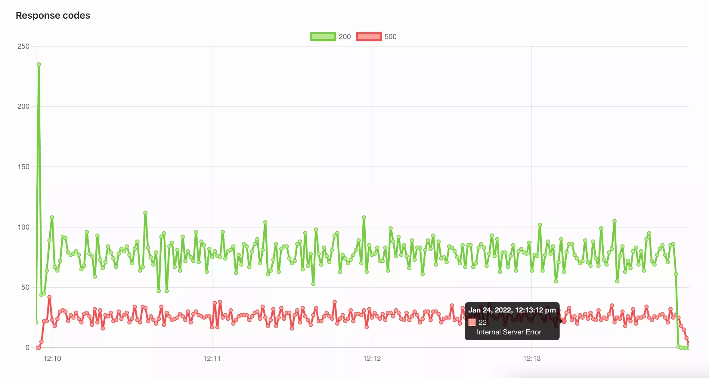
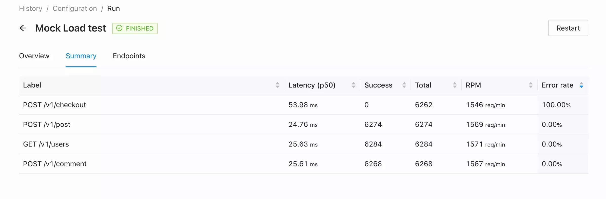

# Introduction

Let's discover **maestro in less than 5 minutes**.

Maestro provides you with an easy way of managing your performance tests, collaborating with the team, and analyzing results. The tool is intended to be a **source of truth for your platform performance**.

## Real-time metrics

In-house Jmeter integration makes it possible to monitor the execution of your tests since they started.

### Hits vs Errors

The core chart is used to understand general test behavior is the relation between Requests per second and count of errors. If you see that two lines have the same number it means that all your requests failing.

### Response time

Using Response time percentiles gives you a quick overview of platform performance based on all endpoints. Maestro uses an average label percentile to generate a graph over all requests that were made. It could be misleading in some cases to analyze the platform performance but this is a really good graph to understand if the test execution goes as expected.

### Response Codes

There are some cases where could have been redirects or just endpoint validation issues that affect performance. Response codes graph is good visualization once you see the performance degradation or just slow response time in general.

### Summary Table

In most cases, the Overview tab is enough to use during test execution. Using a Summary table is helpful to analyze all requests performance and compare them with previous Runs. The table also will bring you closer to the problem and help to do improvements specifically in some endpoints.

### Endpoints

Graph representation of endpoints by adding time as axis x is helpful to compare two endpoints over time and see if their performance depends on each other.

