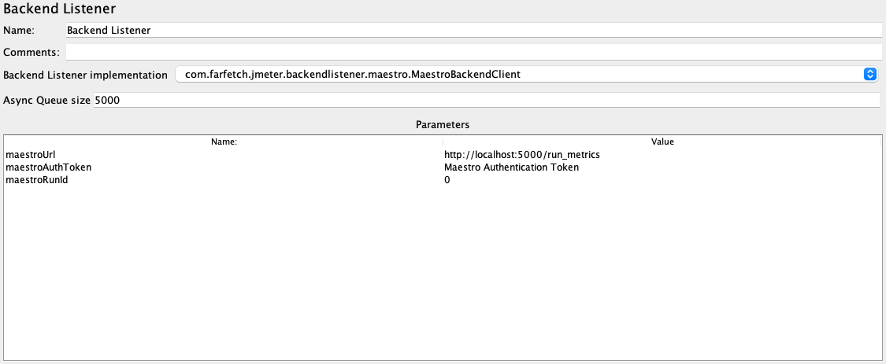

# Maestro Backend Listener for JMeter

Maestro Backend Listener is a JMeter plugins that sends sample results to Maestro API.

## Requirements

  - JDK 1.8
  - Maven 3.8.x

## Installation

  - Create the JMeter BackendListener Maestro plugin JAR package

    ```bash
    mvn package
    ```

  - Put JMeter BackendListener Maestro plugin JAR file into JMeter's lib/ext directory.

## Usage
The plugin relies on the Jmeter properties that are automatically passed by Maestro Agent. The plugin still could be used separately without maestro if you find a use case for it.



 1. Add JMeter BackendListener Plugin to your test plan.
 2. Select `com.farfetch.jmeter.backendlistener.maestro.MaestroBackendClient` Backend Listener Implementation.
 3. Set the parameters `maestroUrl`, `maestroAuthToken` and `maestroRunId` accordingly.

## Credits

This plugin contains modified code from the official [JMeter backend listener plugin](
https://github.com/apache/jmeter/blob/master/src/components/src/main/java/org/apache/jmeter/visualizers/backend/influxdb/).
