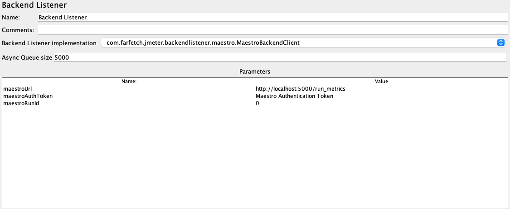

Maestro Backend Listener for JMeter
----
Maestro Backend Listener is a JMeter plugins that sends sample results to Maestro API.


## Sample Result Metrics

- datetime
- elapsed
- label
- datetime
- elapsed
- label
- response_code
- response_message
- thread_name
- data_type
- success
- failure_message
- bytes
- sent_bytes
- grp_threads
- all_threads
- url
- latency
- idle_time
- connect


## Development/Build Environment
### Prerequisites
You need to have the following programs installed in your system:

- JDK 1.8
- Maven 3.8.x


### Create JAR package

To create the JMeter BackendListener Maestro plugin JAR package run:

```bash
mvn package
```

When the packaging process finishes, the .jar file will be available on the directory `./target`.


## Plugin Setup
The main use case for this plugin is to be used with Maestro. The maestro agent will be responsible for injecting the plugin and configuring it for each test it runs. 

If you have a need to use it outside the maestro management scope please follow the steps below:


1. Create the JMeter BackendListener Maestro plugin JAR package and then put it into JMeter's lib/ext directory.
2. Add JMeter BackendListener Plugin to your test plan.
3. Select `com.farfetch.jmeter.backendlistener.maestro.MaestroBackendClient` Backend Listener Implementation.
4. Set the parameters `maestroUrl`, `maestroAuthToken` and `maestroRunId` accordingly.


## Credits
This plugin contains modified code from the official [JMeter backend listener plugin](
https://github.com/apache/jmeter/blob/master/src/components/src/main/java/org/apache/jmeter/visualizers/backend/influxdb/).
